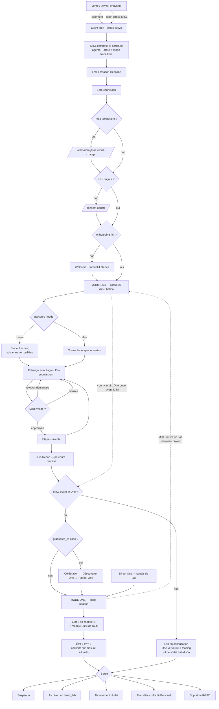

# Cartographie des parcours client — MonprojetPro

> **But de ce document** : décrire TOUS les chemins qu'un client peut emprunter, de la vente jusqu'à
> la sortie, en fonction de toutes les configurations possibles. Destiné à être transformé en
> infographie (le §10 contient un prompt prêt à coller dans ChatGPT).
>
> Sources vérifiées dans le code au 2026-07-26 : `apps/client/middleware.ts`,
> `packages/utils/src/client-mode.ts`, `packages/modules/parcours/actions/launch-client-parcours.ts`,
> `packages/modules/crm/actions/graduate-client.ts`, migrations `supabase/migrations/`,
> `docs/lab-one-lifecycle.md`, `docs/one-vision-v2-2026-06-24.md`, `docs/onboarding-flow.md`,
> `docs/graduation-flow.md`.
>
> ⚠️ Ce document distingue **CE QUI EXISTE DANS LE CODE** (✅) de **CE QUI EST SPÉCIFIÉ MAIS PAS
> ENCORE CÂBLÉ** (🟡). C'est justement là que se cachent les incohérences à corriger.

---

## 1. Le « génome » d'un client — toutes les variables de configuration

Un parcours n'est pas un tunnel unique : c'est le résultat de la **combinaison** de ces variables.
Chaque ligne est un axe indépendant.

### 1.1 Statut du compte (`clients.status`) — ✅ en base

| Valeur | Signification | Effet sur l'accès |
|---|---|---|
| `prospect` | Pas encore client payant | Pas d'espace actif |
| `active` | Client normal | Accès complet |
| `suspended` | Suspendu (impayé, litige) | → écran `/suspended`, tout bloqué |
| `archived` | Archivé | → écran `/archived`, tout bloqué |
| `archived_lab` | Lab archivé (fin de parcours sans suite) | → écran `/archived`, tout bloqué |
| `subscription_cancelled` | Abonnement résilié | 🟡 statut existe en base, comportement d'accès non différencié dans le middleware |
| `handed_off` | Client transféré (offre ① Ponctuel) | 🟡 idem |
| `deleted` | Supprimé | → écran `/archived` |

### 1.2 Les 3 leviers Lab/One (spec `lab-one-lifecycle.md`)

| Levier | Colonne réelle aujourd'hui | Cible spec | État |
|---|---|---|---|
| **A — Le client a un Lab** | `client_configs.lab_mode_available` | `has_lab` (permanent, jamais retiré) | 🟡 aujourd'hui réversible → contradiction avec « accès à vie » |
| **B — Agents du parcours actifs** | `client_configs.elio_lab_enabled` (global) + `client_parcours_agents.status` | `is_active` **par agent** (actif / grisé) | 🟡 granularité par agent pas terminée |
| **C — Accès One ouvert** | `client_configs.one_mode_available` | `one_open` | ✅ ouvrable / refermable |
| **Mode par défaut au login** | `client_configs.dashboard_type` (`lab` \| `one`) | idem | ✅ |
| **Vue choisie par le client** | cookie navigateur `mpp_active_view` | idem | ✅ (ne peut jamais forcer un mode verrouillé) |

### 1.3 Portes d'entrée à franchir une seule fois (`clients`) — ✅

| Colonne | Effet |
|---|---|
| `password_change_required` | → force `/onboarding/password-change` |
| `first_login_at = NULL` | → force `/onboarding/welcome` (et horodate la 1ʳᵉ connexion) |
| `onboarding_completed = false` | → force `/onboarding/welcome` à chaque visite |
| consentement CGU périmé | → force `/consent-update` |
| consentement IA périmé | → force `/ia-consent-update` (géré dans le layout, pas le middleware) |
| `graduated_at` ≠ null ET `graduation_screen_shown = false` | → force `/graduation/celebrate` |

### 1.4 Mode de séquençage du parcours Lab (`client_configs.parcours_mode`) — ✅

| Valeur | Comportement |
|---|---|
| `tracee` | Étape 1 `active`, les suivantes `pending` → déverrouillage à la validation (rail linéaire) |
| `libre` | **Toutes** les étapes `active` d'emblée → le client navigue dans l'ordre qu'il veut |

### 1.5 Offre commerciale (vision One v2) — 🟡 pas de flag technique dédié aujourd'hui

| Offre | Prix | Dashboard One | Lab | Coaching humain |
|---|---|---|---|---|
| ① **Ponctuel** | devis one-shot | ❌ (repart avec kit Lab, standalone) | — | — |
| ② **One** | 39 €/mois | ✅ socle + cockpits | si besoin | ❌ |
| ③ **One+** | 99 €/mois | ✅ socle + cockpits | ✅ à vie | ✅ 1 visio/mois, chat illimité |

### 1.6 Modules activés (`client_configs.active_modules`) — ✅

- 🔵 **Modules RELATION** (socle universel, identiques pour tous) : Accueil, Chat MiKL, Documents,
  Suivi de l'outil, Support, Élio One, Notifications, Paramètres.
- 🟢 **Modules COCKPIT** (sur-mesure, branchés selon le projet livré) : Cockpit Site, Cockpit App…
  → s'« allument » au passage **en chantier → livré**.

### 1.7 Autres axes transverses — ✅

| Axe | Effet |
|---|---|
| **Mode maintenance** (`system_config.maintenance_mode`) | Tous les clients → `/maintenance`. Les opérateurs voient juste une bannière. |
| **Impersonation** (MiKL entre dans le compte) | Court-circuite les écrans « une seule fois » (onboarding, graduation, CGU, changement de mdp) pour ne pas les consommer à la place du client. Chaque mutation est journalisée. |
| **Instance transférée** (`client_instances.status = transferred`) | → écran `/transferred` |

---

## 2. Le couloir d'entrée — ordre EXACT des portes (middleware)

À **chaque** chargement de page, ces contrôles s'exécutent dans cet ordre. La première condition
vraie redirige et arrête tout. C'est la colonne vertébrale de l'infographie.

```
0. Asset statique / webhook ?              → laisse passer
1. Détection de langue (cookie locale)
2. Session d'impersonation expirée ?       → déconnexion + retour Hub
3. Mode maintenance actif ?                → /maintenance   (sauf opérateur)
4. Non connecté sur route protégée ?       → /login?redirectTo=…
5. Connecté sur /login ou /signup ?        → /   (sauf /maintenance)
6. status = suspended ?                    → /suspended
7. status = archived | archived_lab | deleted ? → /archived
8. instance transférée ?                   → /transferred
9. password_change_required ?              → /onboarding/password-change
10. CGU périmées ?                         → /consent-update
11. first_login_at NULL ?                  → horodate + /onboarding/welcome
12. onboarding_completed = false ?         → /onboarding/welcome
13. gradué ET écran pas encore vu ?        → /graduation/celebrate
14. (dans le layout) consentement IA périmé ? → /ia-consent-update
    ↓
    DASHBOARD — mode résolu par resolveClientMode()
```

---

## 3. Les 7 grandes phases du cycle de vie

### Phase 1 — Acquisition / vente Lab
- **Rail nominal** : devis → paiement → facture (Pennylane) → création du client.
- **Court-circuit MiKL** : créer le client et ouvrir le Lab à la main, sans vente.
- Sortie : client créé, `status = active`.

### Phase 2 — Composition du parcours (Hub, côté MiKL)
- MiKL choisit **quels agents Élio** et **dans quel ordre** (`client_parcours_agents.step_order`).
- MiKL choisit le mode : **tracé** (linéaire) ou **libre** (tout ouvert).
- ⚠️ **Dette connue** : l'email « crée ton espace » doit partir **APRÈS** cette validation, sinon le
  client arrive sur un espace au parcours vide.

### Phase 3 — Première connexion du client
- Email d'invitation → création du mot de passe.
- Portes 9→12 du couloir : changement de mdp (si temporaire) → CGU → écran de bienvenue → tutoriel
  interactif (4 étapes, toujours skippable) → redirection vers `/modules/parcours`.

### Phase 4 — Le Lab (incubation)
- Le client traverse ses agents Élio, un par étape.
- Chaque étape : échange avec l'agent → soumission → MiKL valide / demande une révision / refuse.
- Statuts d'une étape : `locked` → `current` → `completed` (ou `skipped`).
- Statuts d'une soumission : `pending` → `approved` / `rejected` / `revision_requested`.
- Statuts du parcours : `en_cours` → `termine` (ou `suspendu` / `abandoned`).
- **Élio Recap** clôt le parcours et envoie une dernière soumission à MiKL.
- 🧪 À tout moment : le client peut télécharger son **kit de sortie Lab** (ses documents validés).

### Phase 5 — Ouverture du One
- MiKL ouvre le One (`one_mode_available = true`), **avec ou sans Lab terminé**.
- Si `graduated_at` est posé → le client voit une seule fois :
  `/graduation/celebrate` (confettis, message perso, récap) → `/graduation/discover-one`
  (présentation des modules) → `/graduation/tour-one` (tutoriel One) → dashboard.
  Chaque écran est skippable.
- Par défaut après ouverture : **tous les agents Lab passent en historique** (consultation seule).
  MiKL peut en **rouvrir un** à tout moment, même après validation.

### Phase 6 — La vie dans le One
- État visuel **« en chantier »** : socle complet + module « Suivi de l'outil » (MiKL poste
  screenshots + messages). Aucune restriction d'accès.
- État visuel **« livré »** : les cockpits sur-mesure s'allument. Onglets identiques.
- Toggle **Mode Lab ↔ Mode One** visible dès que le client a un Lab.
- One+ : 1 visio de coaching/mois incluse, séances supplémentaires facturées (45 € One+ / 75 € One).

### Phase 7 — Sorties possibles
| Sortie | Déclencheur | Résultat |
|---|---|---|
| **Suspension** | impayé / litige | `/suspended`, réversible |
| **Archivage Lab** | fin de parcours sans suite | `archived_lab` → `/archived` |
| **Résiliation abonnement** | client arrête son One | `subscription_cancelled` |
| **Transfert (offre ①)** | outil standalone remis au client | `/transferred` |
| **Kit de sortie Lab** | self-service, permanent | ZIP de ses documents validés |
| **Suppression RGPD** | demande client | `deleted` |

---

## 4. Les 6 chemins types (scénarios de bout en bout)

### 🅰️ Rail nominal complet — « Lab → One »
Vente Lab → parcours composé → email → 1ᵉʳ login → onboarding → Lab tracé → agents validés un à un →
Élio Recap → MiKL ouvre le One + gradue → écrans de graduation → One en chantier → One livré → vie
en abonnement ② ou ③.

### 🅱️ Direct One — jamais de Lab
Client créé directement en `dashboard_type = one`, `lab_mode_available = false`,
`one_mode_available = true` → onboarding → dashboard One directement.
**Pas de toggle** (rien à basculer). Le Mode Lab est inaccessible… **sauf** si MiKL lui ouvre un Lab
plus tard (nouveau projet) → il gagne alors le toggle.

### 🅲 Lab seul — le client s'arrête là
Parcours terminé, One jamais ouvert → le Mode One reste verrouillé avec un **message de teasing**.
Le client garde l'accès à son espace Lab en consultation + son kit de sortie.
Fin possible : `archived_lab`.

### 🅳 Court-circuit — One ouvert avant la fin du Lab
MiKL ouvre le One alors que le parcours est encore `en_cours`.
Résultat : les deux modes disponibles simultanément, agents Lab toujours actifs, toggle visible.

### 🅴 Retour au Lab — nouveau projet pour un client One
Client gradué (ou Direct One) à qui MiKL rouvre un parcours Lab pour un nouveau projet.
Agents réactivés → il chemine dans le Lab tout en gardant son One opérationnel.
En offre ③ One+, le Lab est **actif à vie**.

### 🅵 Parcours libre — pas de rail
`parcours_mode = libre` : toutes les étapes ouvertes d'emblée, le client choisit son ordre.
Aucune notion de déverrouillage. Le reste du cycle est identique.

### 🅶 Offre ① Ponctuel — hors dashboard
Devis → dev en standalone (Supabase + Vercel propres au client) → livraison → transfert de
propriété. Pas de One, pas d'abonnement. Si un Lab a eu lieu, il repart avec le kit de sortie Lab.

---

## 5. Matrice d'états — ce que le client voit

| Profil | Mode Lab | Mode One | Toggle visible ? | Mode par défaut au login |
|---|---|---|---|---|
| Lab en cours, pas de One | ✅ complet (agents selon compo) | 🔒 message teasing | Oui | Lab |
| Lab terminé, One pas ouvert | ✅ consultation (agents off, réouvrables) | 🔒 message teasing | Oui | Lab |
| One ouvert (rail ou forcé) | ✅ consultation, agents réouvrables | ✅ ouvert | Oui | One |
| Direct One (jamais de Lab) | 🚫 inaccessible | ✅ ouvert | **Non** | One |
| Direct One + Lab rouvert | ✅ actif | ✅ ouvert | Oui | selon `dashboard_type` |
| Suspendu / archivé / transféré | 🚫 | 🚫 | — | écran dédié |

**Règle du toggle** : visible dès que le client a (ou a eu) un Lab. Un clic sur un mode verrouillé
affiche un **message**, il n'entre jamais.

**Règle du cookie de vue** : la préférence `mpp_active_view` ne peut activer un mode que s'il est
réellement disponible ; sinon retour au mode par défaut.

---

## 6. Les court-circuits MiKL (depuis le Hub, dans tous les sens)

Principe non négociable : **toute transition est possible, dans les deux sens, sans blocage.**

| Action | Réversible ? |
|---|---|
| Ouvrir un Lab sans vente | Oui |
| Ouvrir un Lab à un client Direct One | Oui |
| Renvoyer / déclencher l'email de création d'espace | — |
| Désactiver un agent précis (reste visible **grisé**) | Oui |
| Réactiver un agent **même après validation** d'une soumission | Oui |
| Ouvrir le One sans Lab terminé | Oui |
| Refermer le One | Oui |
| Suspendre / réactiver un client | Oui |
| Archiver / restaurer | Oui |
| Se connecter en tant que client (impersonation, 1 h max, journalisée) | Oui |

⚠️ **Exception permanente** : on ne retire **jamais** l'espace ni l'historique Lab à un client qui en
a eu un. « Couper le Lab » signifie **couper les agents**, pas cacher l'espace.

---

## 7. Diagramme (Mermaid) — vue d'ensemble



---

## 8. Zones de flou et incohérences — état au 2026-07-26

> ⚠️ **Correction importante** : la première version de ce document listait 7 incohérences en se
> fondant sur la documentation. La vérification dans le code **et dans la base de production** a
> montré que la doc était en retard sur le code : deux points étaient déjà résolus, et deux autres
> n'étaient pas là où la doc les situait. Ce tableau reflète la réalité vérifiée.

| # | Sujet | Réalité vérifiée | État |
|---|---|---|---|
| 1 | **Permanence du Lab** | La permanence était déjà respectée par le code, sauf **un seul endroit** (`pennylane-paid-handlers.ts`, flux « One direct »). Corrigé, et rendu **inviolable par un trigger en base** : une tentative de retrait est neutralisée. Vérifié par un test réel en production. | ✅ Corrigé |
| 2 | **Granularité des agents** | **Était déjà fait** — colonne `is_enabled`, toggle Hub, rendu grisé côté client, réouverture après validation, exclusion du calcul de complétion, mise à jour Realtime par broadcast. La doc était simplement en retard. | ✅ Déjà en place |
| 3 | **Séquencement de l'email** | Le chemin nominal (paiement → composition → email) est **correct**. Le vrai coupable était un second chemin : « créer un Lab après une visio », qui envoyait l'accès sans parcours composé **et sans jamais créer le compte d'authentification** — l'invitation n'aurait de toute façon jamais pu partir, l'échec étant avalé en silence. | ✅ Corrigé |
| 4 | **Statuts non branchés** | Confirmé, et pire que prévu : **aucune policy RLS ne regarde le statut du client**, donc un blocage d'interface aurait été contournable. Traité avec un verrou en base. | ✅ Corrigé |
| 5 | **Offre non modélisée** | Il n'y avait pas zéro modélisation mais **trois colonnes concurrentes** (`subscription_tier`, `elio_tier`, `clients.client_type`). Unifié sur `subscription_tier` = `ponctuel` / `one` / `one_plus` ; `client_type` garde son rôle distinct (**comment** le client est arrivé). | ✅ Corrigé |
| 6 | **Bascule chantier → livré** | L'action ET l'écran de pilotage existaient déjà — **dans le module `admin`**, pas `crm` (d'où le fait qu'une première recherche ne les ait pas trouvés). Le vrai manque était ailleurs : la bascule n'allumait **pas** les cockpits, alors que la notification envoyée au client affirmait le contraire. Le lien est branché. | ✅ Corrigé |
| 7 | **Sources de métriques cockpits** | Décidées projet par projet — décision produit, pas un bug. | 🟡 Ouvert (volontaire) |

### Reste ouvert (hors périmètre du lot du 2026-07-26)

- **5 tests d'interface en échec** : `server-only` est tiré dans des Client Components
  (`client-tabs`, `client-detail-content`, `crm-sub-nav`, `stats-skeleton`, `billing-dashboard`,
  `parcours-timeline`). Cause unique, sujet de **configuration vitest partagée** → à traiter
  d'un bloc, pas test par test.
- **Code mort** : `admin/provision-instance` (provisioning d'instances dédiées). 0 ligne en base,
  mécanisme abandonné par la vision v2.
- **Dette de tests** : plusieurs tests simulent encore le helper `createNotification` alors que la
  production insère directement via le client service-role (pour éviter le `42501` sur un
  `INSERT ... RETURNING` cross-user). `grep -rl "createNotification" --include="*.test.ts*"` les liste.

**Les deux leçons de cette vérification** :
1. Ne jamais cartographier un système depuis sa documentation seule. Ici la doc était **pessimiste**
   (elle listait comme dette des choses déjà construites) et **mal localisée** (mauvais fichier pour
   le bug de l'email).
2. Ne jamais conclure « ça n'existe pas » depuis une recherche limitée à un seul module. Le pilotage
   du `one_status` vivait dans `admin` ; une recherche cantonnée à `crm` a failli faire créer un
   doublon concurrent.

---

## 9. Légende pour l'infographie

| Symbole | Sens |
|---|---|
| 🟪 Violet | Mode Lab |
| 🟩 Vert | Mode One |
| 🟦 Cyan | Actions MiKL depuis le Hub |
| ⬛ Gris | États bloquants (suspendu, archivé, transféré, maintenance) |
| ➡️ Trait plein | Rail nominal automatique |
| ⇢ Trait pointillé | Court-circuit MiKL (toujours possible, réversible) |
| 🔒 Cadenas | Mode verrouillé → affiche un message, pas d'entrée |
| ⚠️ | Point de dette / incohérence connue |

---

## 10. Prompt prêt à coller dans ChatGPT

> Crée une infographie claire et lisible du parcours client de la plateforme SaaS ci-dessous.
>
> **Contraintes visuelles** : format vertical (poster), fond sombre, 3 couleurs de zones —
> violet = Mode Lab, vert = Mode One, cyan = actions de l'opérateur. Les traits pleins sont le
> parcours automatique, les traits pointillés sont les court-circuits manuels de l'opérateur
> (toujours réversibles). Les états bloquants sont en gris. Signale les 7 incohérences avec un
> pictogramme d'alerte.
>
> **Structure demandée** : une colonne centrale pour le rail nominal (vente → composition du
> parcours → 1ʳᵉ connexion → Lab → graduation → One en chantier → One livré → sorties), une bande
> latérale gauche pour le « couloir d'entrée » (les 14 portes du middleware dans l'ordre), une
> bande latérale droite pour les 6 chemins alternatifs, et un encart en bas pour la matrice
> « qui voit quoi ».
>
> Puis coller les §1 à §8 de ce document.

---

*Établi le 2026-07-26 à partir du code source réel. À réviser après chaque évolution du cycle de vie.*
